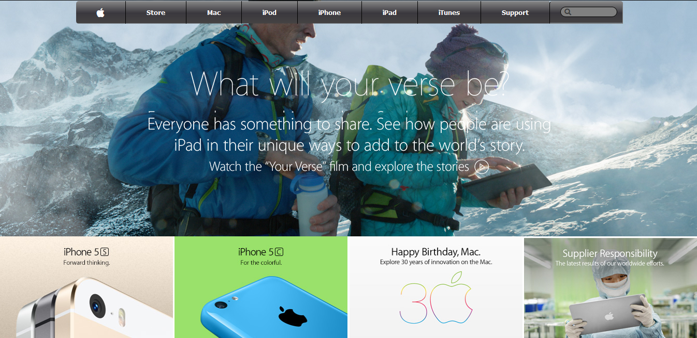

# Microverse Project #4 Building with Backgrounds and Gradients

 Old Apple website clone.

 # Microverse Project #4 04/25/2020.

 # The objetive of this project was to recreate an old Apple website, setting background images as a base canvas and playing with gradiants options in CSS.

 ##   Features Added
 ###  Navigation Bar


 - It has a complete navigation bar as the example website.


 ### Grid background images
- A fixed and responsive grid layout as a background.

 ### Website Footer
  - Copy right
  - Policies Links
 - Links to the main sections of the website.

 ### Screenshorts

 
 
 
 


 ## Built With

 - HTML5,
 - CSS3

 ## Live Demo

 [Live Demo Link](https://rawcdn.githack.com/SigmaSam/PositioningandFloatingElementsGabriel-Samuel/d2c2355b2c16533e02f538d9bdb00cd33388ff34/index.html)


 ## Getting Started

 **This is an example of how you may give instructions on setting up your project locally.**
 **Modify this file to match your project, remove sections that don't apply. For example: delete the testing section if the current project doesn't require testing.**


 To get a local copy up and running follow these simple example steps.

 ### Prerequisites
 - HTML5 semantic tags
 - CSS3
 - Git Workflow

 ### Setup
 - Clone the repo: ```https://github.com/SigmaSam/PositioningandFloatingElementsGabriel-Samuel.git```

 ### Install
 - Open index.htnl with the browser of your choice

 ## Authors
 👤 **Author1**

 - Github: [@githubhandle](https://github.com/Gabkings)

 - Linkedin: [linkedin](https://www.linkedin.com/in/gabriel-gitonga-b5a611183/)

 👤 **Author1**

 - Github: [@githubhandle](https://github.com/SigmaSam)

 ## 🤝 Contributing

 Contributions, issues, and feature requests are welcome!

 Feel free to check the [issues page](issues/).

 ## Show your support

 Give a ⭐️ if you like this project!

 ## Acknowledgments

 - Hat tip to anyone who's code was used
 - Inspiration
 - etc

 ## 📝 License

 This project is [MIT](lic.url) licensed.
